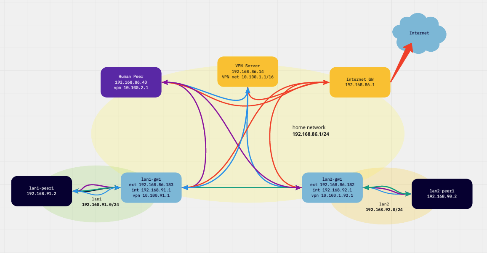

# Site2site with wireguard / innernet

This is a [wireguard](https://www.wireguard.com/#cryptokey-routing) test rig
for [innernet](https://github.com/tonarino/innernet) improvements, i
built it to prove my understanding of wireguard site2site configurations.

## Target

Help to improve the capabilities of
[innernet](https://github.com/tonarino/innernet) with site2site vpn capabilities.
Innernet is not able to route so far.

[Link to the related discussion in innernets repo](https://github.com/tonarino/innernet/discussions/66)

The discussion will be there, not here. This is only to get an
closer look on details, if needed. 

## Lab

The lab rig lives in my regular home network, all components have a leg in
it (192.168.86.0/24) - think it as the evil internet:

 


| function / name     | localnet ip | vpn ip (cidr)| lan ip |
| --------------------| ------------| -------|--------|
| vpn network         |             | 10.100.0.0/16 | |
| vpn server    | 192.168.86.14 | 10.100.0.1/32 | |
| lan1 gw     | 192.168.86.183  | 10.100.91.1/24 | 192.168.91.1 |
| lan1 peer | | | 192.168.91.2
| lan2 gw      | 192.168.86.182 | 10.100.92.1/24 | 192.168.92.1 |
| lan2 peer | | | 192.168.92.2
| human peer | 192.168.86.196  | 10.100.2.1/24  |  |

## Configuration Goals

* human peer can reach both lan peers (wg: blue, innernet: purple)
* lan peer can reach other lan peers (wg: blue, innernet: green)
* external traffic is handled directly (red)
* no configuration changes on any lan peers neccessary
* changes are possible without mental breakdown

.

* get an idea what is needed to build the same with innernet

## Configuration

Wireguard uses port 51830 on all vpn peers and interface wg1 on all linux peers.
IPv6 is switched off on all linux peers (more control in the lab).

```bash
root@nine-one:~# grep -v ^# /etc/sysctl.conf|sort|uniq

net.ipv4.ip_forward=1
net.ipv6.conf.all.disable_ipv6=1
net.ipv6.conf.default.disable_ipv6=1
net.ipv6.conf.lo.disable_ipv6=1
```

#### vpn server

[vpn-server-wg.conf](vpn-server-wg.conf)

`PostUp` adds forward rules, they are needed while the dockerd on it changes 
the iptables forward chain policy to drop.

It also adds routes to the hidden lan1/2 networks.

#### lan gw

[lan1-gw1-wg.conf](lan1-gw1-wg.conf)

[lan2-gw1-wg.conf](lan2-gw1-wg.conf)

`PostUp` adds routes to the counterpart lan (do not use the default route) and
masquerades traffic to the ip address assigned to the interfaces, so there is
no change neccessary to nodes in `lan1/2`. 

It would be possible to use the vpn server as gateway address but thats not the
case in the later innernet scenario.

#### human peer

[human-peer-wg.conf](human-peer-wg.conf)

Since the [macos wireguard
gui](https://apps.apple.com/us/app/wireguard/id1451685025?ls=1&mt=12) cannot
handle `PostUp`, i use also wg-quick on the mac.

`PostUp` adds routes to the hidden `lan1/2` networks.

## This is real hardware

Since Docker and other virtualizations will add things to my network stack
and i wanted to test the network stack, i built this in real hardware.

All but the human peer (mbp) are part of my herd of singleboard
computers (raspi 2, 3, 4, odroid h2, atom).
